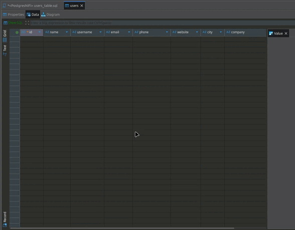

# 🚀 NiFi: Extracción de Usuarios → PostgreSQL

<p align="center">
  
</p>

Este proyecto implementa un flujo de ETL (Extracción, Transformación y Carga) completo utilizando Apache NiFi para automatizar el proceso de obtención de datos desde una API pública, su posterior transformación y la inserción final en una base de datos PostgreSQL.

La infraestructura completa se gestiona a través de Docker Compose, lo que simplifica su despliegue en cualquier entorno que tenga Docker instalado.

## ➡️ Flujo del Proyecto (Diagrama ETL)
El flujo de procesamiento de datos está diseñado para ser directo y eficiente, moviendo los datos secuencialmente a través de cada componente.

```
┌───────────────────┐
│  GenerateFlowFile │ → Genera FlowFiles de prueba para iniciar el flujo.
└─────────┬─────────┘
          │
          ▼
┌────────────────────────────┐
│  UpdateAttribute           │ → Construye la URL de la API de forma dinámica.
│  (api.url dinámico)        │
└─────────┬──────────────────┘
          │
          ▼
┌───────────────────┐
│    InvokeHTTP     │ → Realiza la petición GET a la API externa.
└─────────┬─────────┘
          │
          ▼
┌──────────────────────┐
│  PutDatabaseRecord   │ → Inserta los datos procesados en la base de datos PostgreSQL.
└──────────────────────┘
```

## 📋 Descripción Detallada de los Processors

1. **GenerateFlowFile**
   - Genera FlowFiles vacíos que actúan como disparadores.
   - Configurado para crear 10 FlowFiles, uno para cada usuario que se extraerá de la API.

2. **UpdateAttribute**
   - Añade un atributo dinámico `api.url` a cada FlowFile.
   - Expresión utilizada: 
     ```text
     https://jsonplaceholder.typicode.com/users/${uuid:mod(10):plus(1)}
     ```
   - Permite que InvokeHTTP haga peticiones individuales para cada usuario.

3. **InvokeHTTP**
   - Hace una petición GET a la URL definida en `${api.url}`.
   - La respuesta JSON del usuario se convierte en el contenido del FlowFile.

4. **PutDatabaseRecord**
   - Inserta los datos en PostgreSQL usando JsonTreeReader.
   - Mapea automáticamente los campos JSON a las columnas de la tabla `users`.

## 💾 Configuración de la Base de Datos

- **Host:** postgres
- **Puerto:** 5433
- **Base de Datos:** nifi_db
- **Usuario:** nifi
- **Contraseña:** nifi123

### Estructura de la Tabla `users`
```sql
CREATE TABLE users (
  id INT PRIMARY KEY,
  name TEXT,
  username TEXT,
  email TEXT,
  phone TEXT,
  website TEXT,
  address_city TEXT,
  company_name TEXT
);
```

## 🔌 Configuración del Driver JDBC

Para que NiFi pueda comunicarse con PostgreSQL:

1. Descargar el driver JDBC (ej: `postgresql-42.7.6.jar`).
2. Colocar el archivo `.jar` en la carpeta `./drivers` del proyecto.
3. Configurar el servicio DBCPConnectionPool en NiFi:
   - **Database Driver Class Name:** `org.postgresql.Driver`
   - **Database Driver Location(s):** `/opt/nifi/drivers/postgresql-42.7.6.jar`
   - **Database URL:** `jdbc:postgresql://postgres:5433/nifi_db`
   - **Usuario / Contraseña:** `nifi / nifi123`

## ⚡ Guía de Inicio Rápido

1. **Levantar la Infraestructura:**
```bash
docker-compose up -d
```
2. **Abrir NiFi:** 🌐 [https://localhost:8443/nifi/](https://localhost:8443/nifi/)
3. **Habilitar Servicios:** ✅ DBCPConnectionPool y JsonTreeReader.
4. **Conectar los Procesadores:** 🔗 Según el flujo ETL.
5. **Ejecutar el Flujo:** ▶️ Iniciar GenerateFlowFile.
6. **Verificar los Datos:** 🔍
```sql
SELECT * FROM users;
```

## 📤 Exportación y Reutilización del Flujo

- Crear un **Template** desde NiFi:
  1. Selecciona todos los Processors.
  2. Clic derecho → Create Template.
  3. Descargar el XML generado.
- En otra instancia, subir el template y arrastrarlo al canvas para recrear el flujo completo.

## 🛠️ Tecnologías Clave Utilizadas
- Apache NiFi: 2.5
- PostgreSQL
- Docker Compose
- API Pública: jsonplaceholder.typicode.com/users
